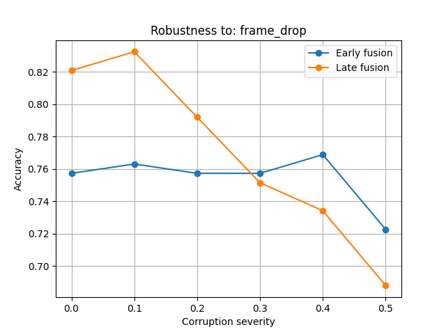
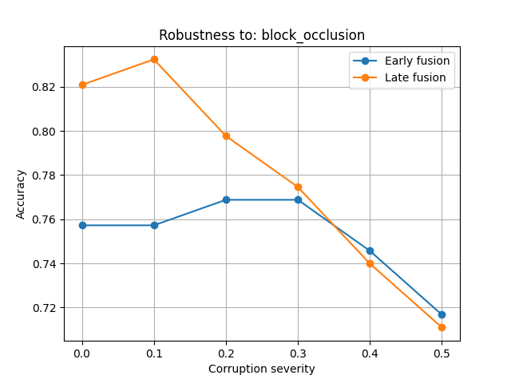
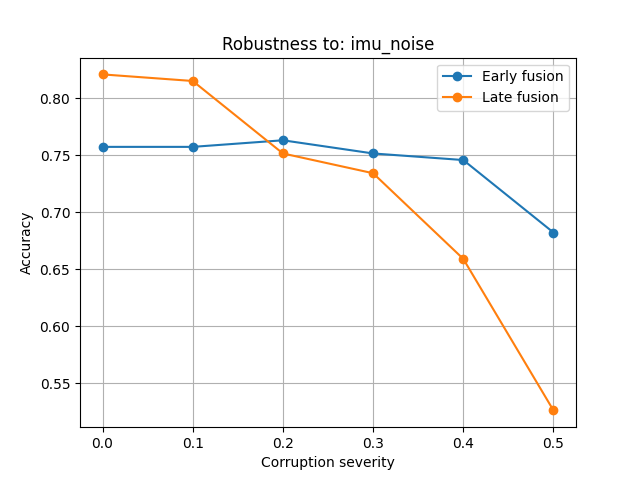

# Sensor Fusion Robustness Study

**Investigating how vision+IMU fusion models degrade under simulated sensor failure, and whether early or late fusion survives failure more gracefully.**

## Research Question

When a vision+IMU human activity recognition system experiences partial sensor
failure — dropped camera frames, sustained camera occlusion, or noisy IMU
readings — does it fail gracefully or catastrophically? And does the fusion
strategy (early vs. late) change how gracefully it degrades?

## Why This Matters

Most human activity recognition research reports accuracy under clean, ideal
sensor conditions. Real-world robotic and wearable systems experience partial
sensor failure routinely — a blocked camera, a glitchy accelerometer, a dropped
frame from a laggy connection. This project measures, rather than assumes, how
much that matters, and whether a common architectural choice (early vs. late
fusion) offers any real protection against it.

## Dataset

[UTD-MHAD](https://personal.utdallas.edu/~kehtar/UTD-MHAD.html) (UT Dallas
Multimodal Human Action Dataset) — a public dataset of 27 actions, 8 subjects,
4 trials each, with synchronized RGB video and wrist-worn IMU
(accelerometer + gyroscope) data. 861 paired video+IMU samples used in this
study. The dataset itself is not included in this repo due to size — see
Setup below for download instructions.

## Method

**Two fusion architectures compared:**
- **Early fusion** — vision and IMU features are extracted separately, then
  concatenated into a single combined representation before a shared
  classifier makes the final prediction.
- **Late fusion** — vision and IMU branches each produce an independent
  prediction, which are then averaged to form the final output.

**Three corruption types simulated at test time, each at six severity levels
(0.0 to 0.5):**
- **Random frame drop** — individual video frames zeroed out at random,
  simulating a laggy or dropped camera feed.
- **Block occlusion** — one continuous stretch of video zeroed out,
  simulating the camera being physically blocked.
- **IMU noise** — Gaussian noise added to the IMU signal, scaled relative to
  the signal's own standard deviation, simulating a malfunctioning sensor.

A lightweight CNN handles the vision branch; a small 1D-CNN handles the IMU
branch. Both models are trained for 15 epochs on an 80/20 train/test split,
with no hyperparameter search, to keep the pipeline fully reproducible on
free-tier Google Colab.

## A Note on Baseline Accuracy

Baseline accuracy (~75-83%, varying slightly across training runs) is lower
than published UTD-MHAD results using larger, tuned architectures. This is an
accepted, deliberate tradeoff: the research contribution here is not
state-of-the-art accuracy, but the *relative* robustness comparison between
fusion strategies under simulated sensor failure, which holds regardless of
the absolute baseline accuracy level.

## Results

### Robustness to Frame Drop


Late fusion starts higher at low severity but degrades faster, crossing
below early fusion around severity 0.3. At severity 0.5, early fusion holds
at 72.3% versus late fusion's 68.8%.

### Robustness to Block Occlusion


The same crossover pattern appears, though the gap at high severity is much
narrower here: early fusion at 71.7% versus late fusion at 71.1% at severity
0.5 — a difference small enough that it may not be meaningful given the
dataset size.

### Robustness to IMU Noise


The clearest and largest version of the same pattern. At severity 0.5, early
fusion holds at roughly 68% accuracy while late fusion collapses to roughly
53% — a substantial, consistent gap, and the earliest crossover point of the
three (around severity 0.2).

## The Overall Pattern

Across all three corruption types, the same shape repeats: **late fusion
starts higher at low-to-moderate corruption severity, but degrades faster and
crosses below early fusion as severity increases.** The size of this effect
varies — negligible for block occlusion, moderate for frame drop, and large
for IMU noise — but the direction is consistent across all three experiments.

**Interpretation:** late fusion averages two independent predictions with
fixed weight. At low corruption, this works well because both modalities are
still mostly reliable. As corruption increases, one branch's prediction
degrades toward noise, but late fusion keeps blindly averaging it in at full
weight, dragging the combined result down. Early fusion instead feeds a
shared classifier with combined features, giving it more flexibility to
implicitly lean on whichever modality remains more reliable as corruption
increases. This would explain why early fusion's advantage grows with
severity rather than being constant — it only becomes useful once one
modality's signal is bad enough to actively hurt a fixed-weight average.

**Practical implication:** late fusion is the better choice when sensor
failure is expected to be mild or occasional; early fusion is the more
robust choice when severe sensor failure is a real possibility. Neither
strategy is a strictly "safer" default — the right choice depends on the
expected failure severity in the deployment environment.

## A Bug Worth Mentioning

The first pass at the IMU noise experiment showed almost no accuracy drop at
any severity level, which looked like a promising robustness result but was
actually a measurement error: the noise magnitude used (`noise_std=0.5`) was
roughly 120x smaller than the actual standard deviation of the real IMU
signal (~60), so the "corruption" was nearly invisible to the model. Fixed
by scaling injected noise relative to each sample's own signal standard
deviation rather than using a fixed absolute value. The results above reflect
the corrected version.

## Setup

```bash
wget http://www.utdallas.edu/~kehtar/UTD-MAD/RGB.zip
wget http://www.utdallas.edu/~kehtar/UTD-MAD/Inertial.zip
unzip RGB.zip -d data/rgb
unzip Inertial.zip -d data/inertial
```

Then open `sensor_dropout_experiment.ipynb` in Colab or Jupyter and run the
cells in order.

## Status

- [x] Data pipeline (video + IMU loading and pairing)
- [x] Early fusion and late fusion models implemented
- [x] Baseline training and evaluation
- [x] Robustness experiments across all three corruption types
- [x] Results visualized and documented
- [ ] Dropout-augmented training as a mitigation experiment (in progress)
- [ ] Interactive Streamlit dashboard for exploring results (planned)

## Future Work

- Test whether training with corruption randomly injected (dropout
  augmentation) closes the robustness gap for either fusion strategy
- Extend to a third, attention-based fusion strategy for comparison
- Evaluate on a second multimodal action dataset to check whether the
  failure-specific pattern generalizes beyond UTD-MHAD
